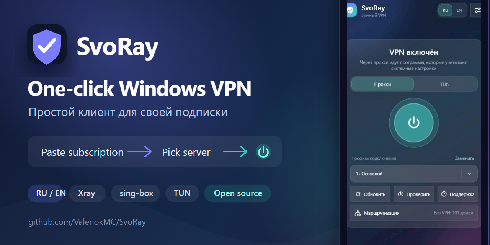

<div align="center">



# SvoRay

**A simplified Windows VPN client built on the open-source [v2rayN](https://github.com/2dust/v2rayN) 7.24.4 codebase.**<br>
**Paste your own subscription, pick a server, press one button.**

[](https://github.com/ValenokMC/SvoRay/releases/latest)
[](https://github.com/ValenokMC/SvoRay/releases)
[](LICENSE)
[](https://github.com/2dust/v2rayN)

[](#install)
[](#what-it-does)
[](SUPPORT.md)
[](https://t.me/SupporBiBot)

**English** · [Русский](README_RU.md) · [Changelog](CHANGELOG.md) · [Releases](https://github.com/ValenokMC/SvoRay/releases) · [Support](SUPPORT.md)

[**Download SvoRay for Windows →**](https://github.com/ValenokMC/SvoRay/releases/latest)<br>
Windows 10/11 x64 · installer and portable ZIP · no account required

</div>

---

You paste your own subscription link or a single profile, pick a server, and press one button. Everything else — TUN routing, DNS, adapter selection — is configured for you. The full v2rayN interface stays one click away for anything the simple screen does not cover.

> ⭐ If SvoRay makes v2rayN easier for you, star the repository. It helps other Windows users find
> the project without ads or paid promotion.

## Why SvoRay

SvoRay is for people who already have a v2rayN-compatible subscription but do not want to manage
the full client every day. It keeps the proven v2rayN, Xray and sing-box foundation and adds a
focused front screen for the actions that matter most.

| You want to… | SvoRay simple screen | Full v2rayN interface |
| --- | --- | --- |
| Connect for everyday use | One power button | Available in one click |
| Choose a server | Compact profile selector | Full profile table and groups |
| Route selected domains | Guided domain list and Russia preset | Complete routing editor |
| Diagnose or tune the core | Basic latency and exit checks | All advanced controls |

SvoRay is not a subscription seller and does not lock you into a provider. Bring your own
subscription or profile and keep the option to use every upstream v2rayN setting.

## What it does

- one screen: connection status, a power button, a profile selector
- Russian and English simple interfaces, selected in the header and applied after restart
- imports an HTTPS subscription or an individual `vless://`, `hysteria2://` and other links v2rayN supports
- two connection modes: TUN for the whole system, or the Windows system proxy
- a domain list that decides what the VPN carries: everything except the list, or the list only
- picks the active Ethernet/Wi-Fi adapter and local IPv4 automatically
- excludes the selected server's IP from TUN so traffic cannot loop
- Cloudflare DNS: `1.1.1.1` and `https://1.1.1.1/dns-query`
- tray icon that shows state by shape, not only by colour
- latency check for the selected profile, and a live check of the running tunnel that reports the exit country
- a support button that uses the subscription provider's safe HTTP/HTTPS/Telegram link or falls back to GitHub Issues
- the complete v2rayN interface for manual settings and diagnostics

## What it does not do

SvoRay routes your traffic through a server you supply. It does not provide anonymity, and it cannot guarantee the absence of leaks. It comes with no servers — you bring your own subscription.

## Install

1. Download `SvoRay-<version>-setup.exe` from [Releases](../../releases).
2. Optionally verify the download against `SHA256SUMS.txt` published with the release:

   ```powershell
   Get-FileHash .\SvoRay-0.4.0-setup.exe -Algorithm SHA256
   ```

   The build is not signed with a commercial certificate, so comparing the hash is the only way to confirm you got the right file.
3. Run the installer. **Windows SmartScreen may warn about an "Unknown publisher"** — same reason: no commercial signature. Choose *More info* → *Run anyway* if you decide to continue.
4. Confirm the UAC prompt. Administrator rights are required because TUN mode does not work without them.

A Start-menu shortcut is created. No desktop shortcut.

## First run

1. Launch SvoRay and confirm the UAC prompt.
2. The first launch follows the Windows UI language. Use **RU / EN** in the header to save another
   language, then restart SvoRay as the notice says.
3. Paste your subscription link or a single profile into the field and press **Import / Импортировать**.
4. The form is replaced by a profile selector, and the first usable profile is selected automatically.
5. Pick a mode: **Proxy / Прокси** covers applications that honour the Windows system proxy, **TUN** covers the whole system.
6. Press the power button. Press it again to disconnect.
7. **Check / Проверить** measures latency for the selected profile.
8. **Routing / Маршрутизация** edits the domain list. Type `example.com`; subdomains are matched too, a whole list can be pasted at once, and the Russia preset fills in sites that commonly refuse a foreign address. DNS for a listed domain takes the same path as its traffic.
9. **Support / Поддержка** opens the provider link supplied by the subscription, or GitHub Issues when none is available.
10. The settings icon opens the full v2rayN interface.

## Update

Run the new installer over the current version. Settings, subscriptions and profiles are kept. The installer closes the running client and core before replacing files.

## Uninstall

*Settings* → *Apps* → *SvoRay* → *Uninstall*. The uninstaller asks separately whether to delete your settings, subscriptions and profiles; by default it keeps them.

## Where your data is stored

```
%LOCALAPPDATA%\SvoRay
```

**This folder contains your subscription URL and profile credentials in clear text.** Do not send it to anyone and do not attach it to bug reports. Attach only the relevant lines from `guiLogs`, after checking them.

Because the client runs elevated, `%LOCALAPPDATA%` belongs to the account used to elevate. With an ordinary UAC confirmation by the same user, that is their own profile.

## Build from source

Requires the .NET 10 SDK and Inno Setup 6 (`winget install --id JRSoftware.InnoSetup`).

```powershell
.\build\BuildInstaller.ps1
```

The script publishes a self-contained build, adds the v2rayN/Xray/sing-box/geodata components, and produces the installer, a portable ZIP, a source ZIP and `SHA256SUMS.txt` in `dist`.

Core binaries (`xray.exe`, `sing-box.exe`, `wintun.dll`) are copied from a local official v2rayN installation; the path is the `-CoreSource` parameter.

## Status

Version 0.4.0. What changed in each version: [CHANGELOG.md](CHANGELOG.md). Detailed 0.4.0
notes: [docs/RELEASE_NOTES_0.4.0_RU.md](docs/RELEASE_NOTES_0.4.0_RU.md) (Russian).

A pre-publication security audit has been completed — see [docs/SECURITY_AUDIT.md](docs/SECURITY_AUDIT.md) for scope, findings, fixes and remaining risks. Notable fixes it produced: the downloaded subscription payload no longer reaches the log files, and profile links are kept out of the on-screen notice stream.

Verified for 0.4.0: Release build and installer, 115/115 unit tests, complete Russian/English resources, safe support-header parsing and SQLite schema update. The English simple screen and the RU/EN control were visually inspected. Earlier release testing covered clean install, install over a previous version, import and subscription update, latency check and tray behaviour.

Not verified in a live 0.4.0 session: the full import/connect/check/routing flow on both languages, a provider-supplied `Support-Url`, clean install or upgrade with this installer, uninstall with both user-data answers, Windows scaling at 125 % and 150 %, and the 0.3.1 core shutdown on disconnect.

Known open defect: a single unexplained `OutOfMemoryException` was observed once, raised while the thread pool was creating a worker thread. It has not been reproduced. If the client hangs or exits unexpectedly, please do not close the process — capture a dump first and open an issue.

## Frequently asked questions

### Does SvoRay include VPN servers?

No. SvoRay is a client for your own subscription or individual profile. It does not sell or bundle
access to third-party servers.

### Why does it request administrator rights?

TUN mode needs elevated rights to route system traffic. Proxy mode is also available, but the app
currently starts elevated so both modes can be selected without relaunching it.

### Is the installer signed?

Not with a commercial code-signing certificate. Windows SmartScreen may therefore show
“Unknown publisher.” Verify the installer against the `SHA256SUMS.txt` file attached to the same
release before running it.

### Can I still use advanced v2rayN settings?

Yes. The settings button opens the complete v2rayN interface for diagnostics and manual tuning.

## Help SvoRay grow

- Star the repository if the focused interface is useful to you.
- Share a reproducible bug or idea through [Issues](https://github.com/ValenokMC/SvoRay/issues).
- Ask usage questions in [Discussions](https://github.com/ValenokMC/SvoRay/discussions).
- Improve code, documentation or translations using [CONTRIBUTING.md](CONTRIBUTING.md).
- Use the ready-made bilingual copy and images in the [community sharing kit](docs/SHARE_SVORAY.md).

## License

GPL-3.0. The complete corresponding source is published with every binary release as `SvoRay-<version>-source.zip`.

See [LICENSE](LICENSE), [THIRD_PARTY_NOTICES.md](THIRD_PARTY_NOTICES.md), and the upstream project: <https://github.com/2dust/v2rayN>.

SvoRay is an independent fork. It is not affiliated with or endorsed by the v2rayN project.
